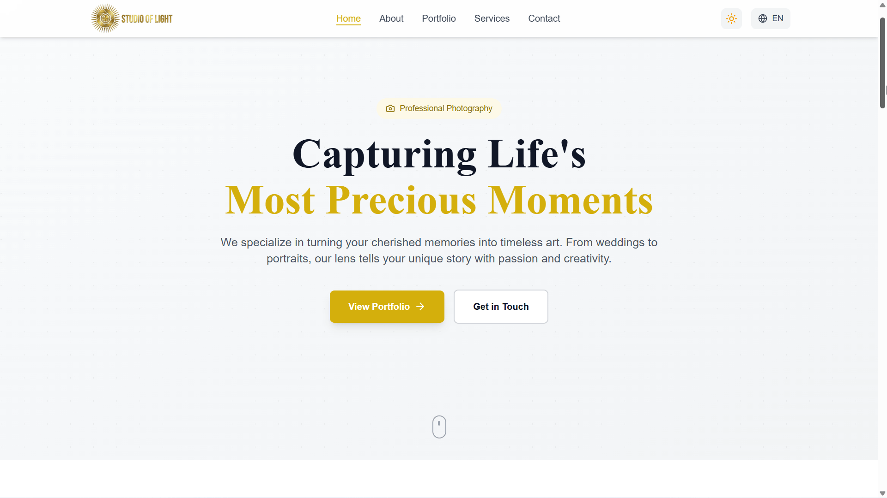
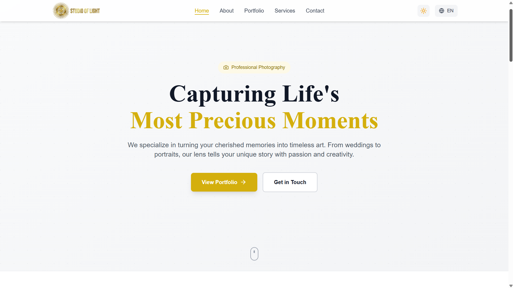
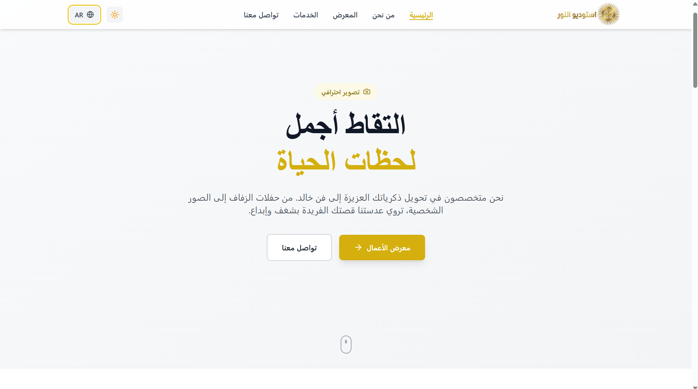
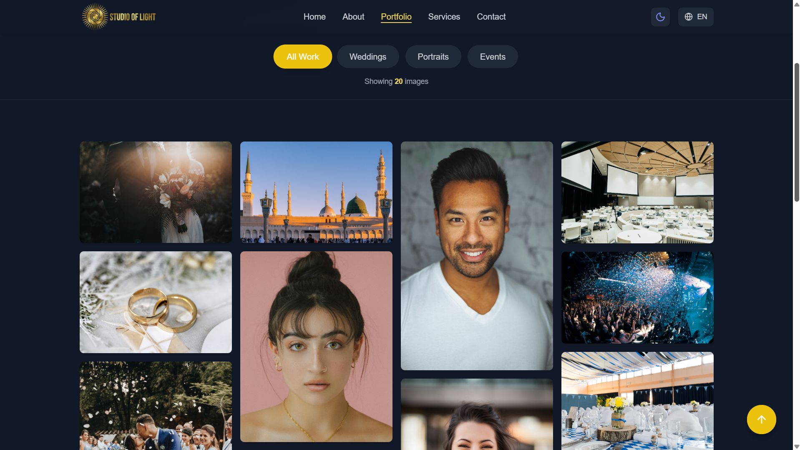
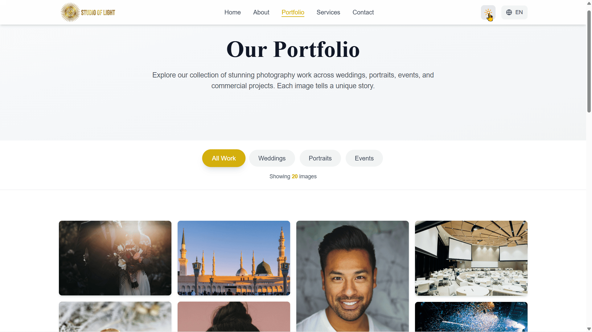
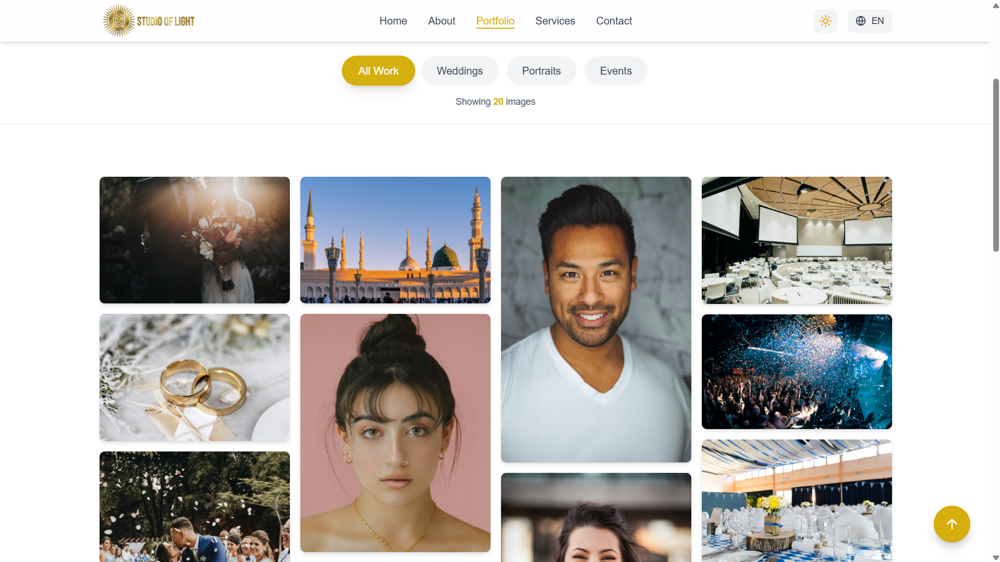
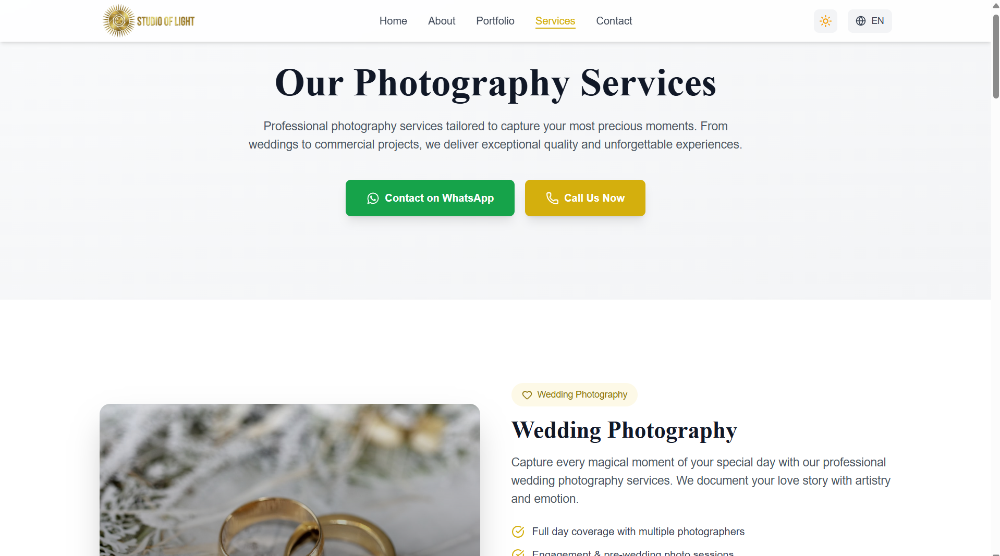

# Studio of Light — Bilingual Photography Portfolio

> A production-ready, bilingual (Arabic/English) photography portfolio website with full RTL support, dark mode, and smooth animations.

🔗 **Live:** [studio-of-light-portfolio.vercel.app](https://studio-of-light-portfolio.vercel.app/)



---

## ✨ Features

- 🌐 **Full Bilingual Support** — English/Arabic with 4,000+ translation keys
- 🔄 **Automatic RTL Layouts** — Entire UI flips for Arabic language
- 🌙 **Dark Mode** — With smooth transitions and system preference detection
- 📸 **Portfolio Gallery** — Lightbox viewer with keyboard navigation and category filtering
- 📱 **Fully Responsive** — 7 pages optimized for all devices
- 🎨 **Custom Design System** — 10-shade gold color palette for light/dark themes
- 📧 **Contact Form** — With validation and WhatsApp integration
- 🔍 **SEO Optimized** — Dynamic meta tags, XML sitemap, robots.txt

---

## 🛠️ Tech Stack

| Technology | Purpose |
|-----------|---------|
| React 19 | UI framework |
| Vite | Build tool |
| Tailwind CSS | Styling and dark mode |
| i18next | Internationalization |
| Framer Motion | Animations |
| React Router v7 | Routing |
| React Hook Form | Form handling |
| React Helmet | SEO |
| Vercel | Deployment |

---

## 📸 Screenshots

### English (LTR)


### Arabic (RTL)


### Dark Mode


### Dark Mode Toggle


### Gallery


### Services


---

## 🏗️ Architecture

```
src/
├── components/          # Reusable UI components
├── pages/              # 7 page components
├── locales/
│   ├── en/             # English translations (8 namespace files)
│   └── ar/             # Arabic translations (8 namespace files)
├── hooks/              # Custom React hooks
├── styles/             # Global styles and Tailwind config
└── utils/              # Helpers and utilities
```

---

## 🚀 Run Locally

```bash
git clone https://github.com/MuhamedSaid/studio-of-light.git
cd studio-of-light
npm install
npm run dev
```

---

## 📫 Contact

- **Portfolio:** [muhammedsaid.vercel.app](https://muhammedsaid.vercel.app/)
- **LinkedIn:** [muhammed-said](https://www.linkedin.com/in/muhammed-said-323982213/)
- **Email:** muhammed.said1312@gmail.com
